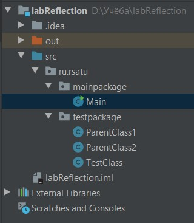
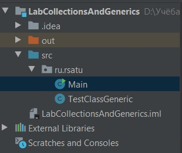
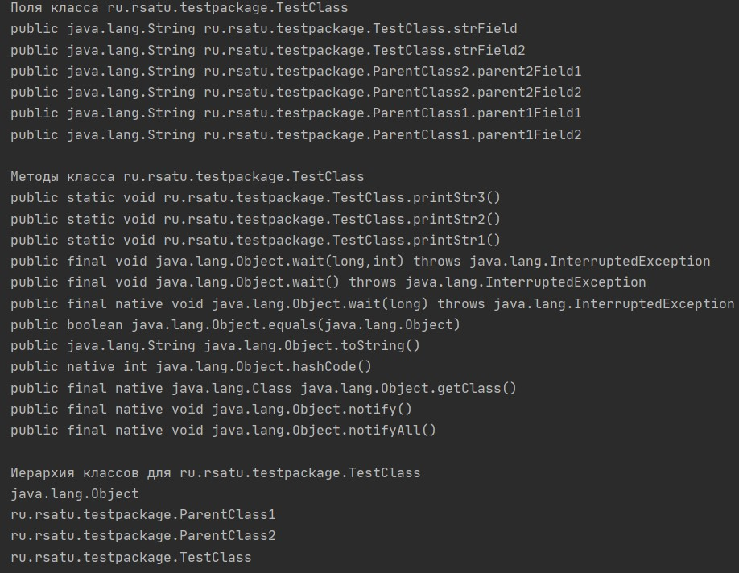
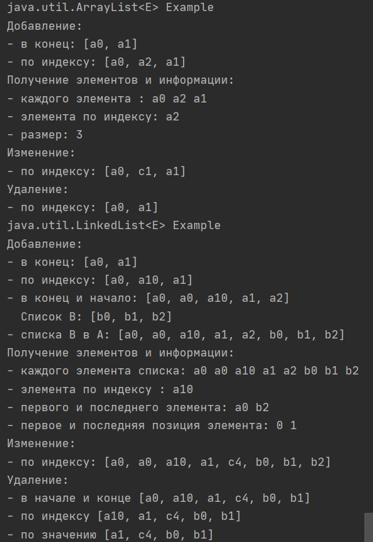
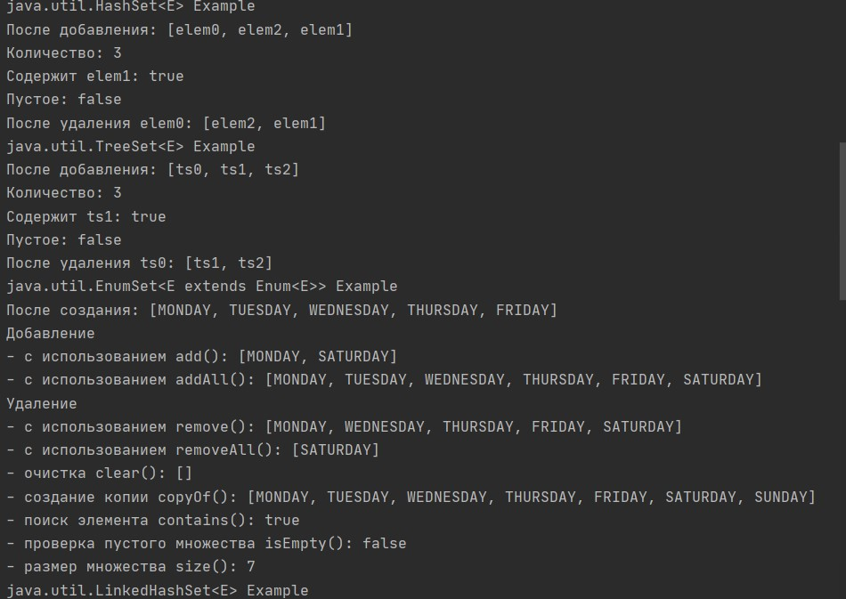
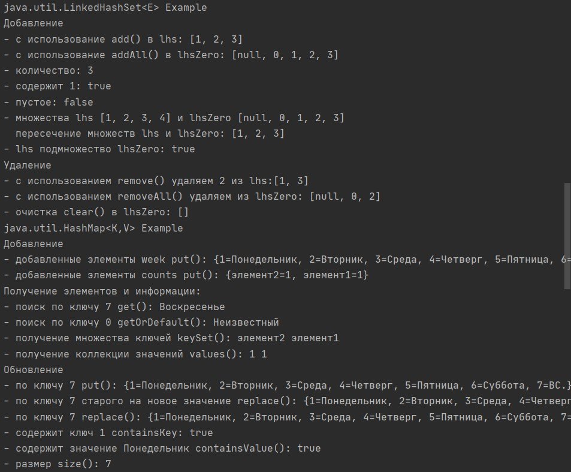
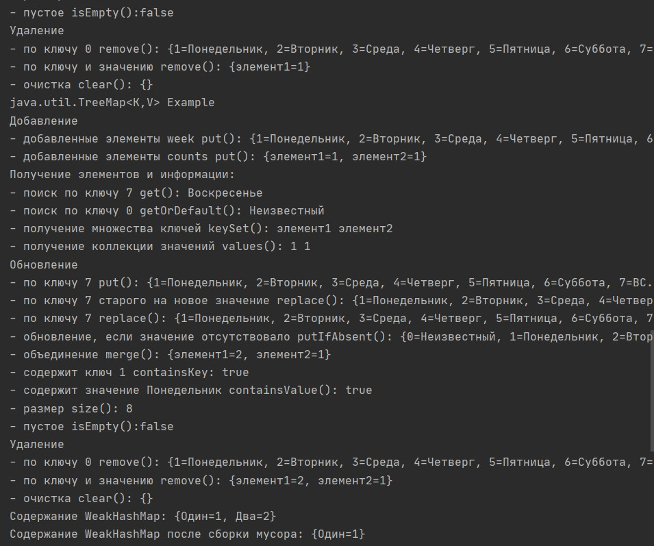
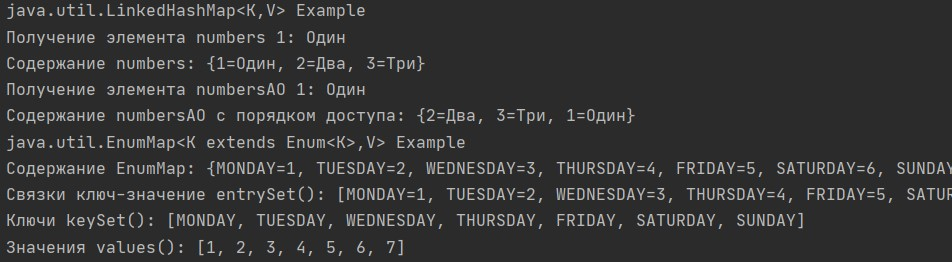
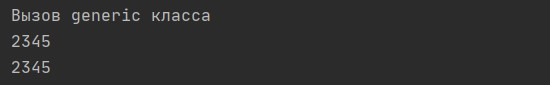
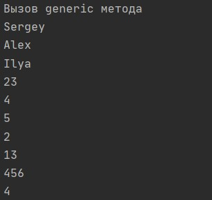

= Отчет по лабораторной работе 3
Студентов группы ПИМ-21 Бубенцова С.А. Носкова И.А.
:figure-caption: Рисунок
:listing-caption: Листинг
:source-highlighter: coderay

== 1 Постановка задачи
В процессе выполнения лабораторной работы необходимо выполнить следующие задачи:

. Выгрузить все поля и методы класса с помощью рефлексии. Вызвать несколько методов класса. Вывести на экран всех предков класса.
. Ознакомится со всеми коллекциями java (list, set, map) и их реализацией.
. Сделать класс с дженериком.
. Сделать метод с дженериком.

== 2 Выполнение

=== 2.1 Структура проекта

.Структура проекта для первого задания

.Структура проекта второго, третьего и четвертого заданий

=== 2.2 Задание 1
Для вывода информации о полях, методах, аннотациях, конструкторах, интерфейсах и предках класса были созданы соответствующие методы. Пример листинга приведен ниже.

.Листинг методов getFields и getMethods
[source, java]
----
    void getFields(Class mTestClass){
        System.out.println("Поля класса " + mTestClass.getName());
        for (Field field : mTestClass.getFields()) {
            System.out.println(field);
        }

    }
    
    void getMethods(Class mTestClass){
        System.out.println("\nМетоды класса " + mTestClass.getName());
        for (Method method : mTestClass.getMethods()) {
            System.out.println(method);
        }
    }
----

.Листинг метода showHierarchy
[source, java]
----
    static void showHierarchy(Class<?> c) {
        if (c.getSuperclass() == null) {
            System.out.println(c.getName());
            return;
        }
        showHierarchy(c.getSuperclass());
        System.out.println(c.getName());
    }
----

Далее были исполнены некоторые методы класса TestClass, а именно выполнены методы, которые выводят текстовые строки в консоль.
 
.Вызов методов
[source, java]
----
        System.out.println("\nВызов метода printStr1");
        callMethod(mTestClass, "printStr1");
        System.out.println("\nВызов метода printStr2");
        callMethod(mTestClass, "printStr2");
----

.Листинг метода callMethod
[source, java]
----
    static void showHierarchy(Class<?> c) {
        if (c.getSuperclass() == null) {
            System.out.println(c.getName());
            return;
        }
        showHierarchy(c.getSuperclass());
        System.out.println(c.getName());
    }
----

=== 2.3 Задание 2
Для ознакомления с коллекциями созданы объекты и выполнены несколько методов.

.Работа с ArrayList
[source, java]
----
    public static void arrayListExample() {
        System.out.println("java.util.ArrayList<E> Example ");
        ArrayList<String> listA = new ArrayList<>(10);
        System.out.println("Добавление: ");

        listA.add("a0");
        listA.add("a1");
        System.out.println("- в конец: " + listA);

        listA.add(1, "a2");
        System.out.println("- по индексу: " + listA);
        System.out.println("Получение элементов и информации: ");
        System.out.print("- каждого элемента : ");
        for (String el:listA){
            System.out.print(el+" ");
        }
        System.out.println();

        System.out.println("- элемента по индексу: " + listA.get(1));

        System.out.println("- размер: " + listA.size());

        System.out.println("Изменение: ");

        listA.set(1, "c1");
        System.out.println("- по индексу: " + listA);

        System.out.println("Удаление: ");

        listA.remove(1);
        System.out.println("- по индексу: " + listA);
    }
----
.Работа с LinkedList
[source, java]
----
    public static void linkedListExample() {
        System.out.println("java.util.LinkedList<E> Example ");
        LinkedList<String> listA = new LinkedList<>();

        System.out.println("Добавление: ");

        listA.add("a0");
        listA.add("a1");
        System.out.println("- в конец: " + listA);

        listA.add(1, "a10");
        System.out.println("- по индексу: " + listA);

        listA.addFirst("a0");
        listA.addLast("a2");
        System.out.println("- в конец и начало: " + listA);

        List<String> listB = new LinkedList<>();
        listB.add("b0");
        listB.add("b1");
        listB.add("b2");
        System.out.println("  Список B: " + listB);

        listA.addAll(listB);
        System.out.println("- списка B в A: " + listA);

        System.out.println("Получение элементов и информации: ");

        System.out.print("- каждого элемента списка: ");
        for (String el:listA){
            System.out.print(el+" ");
        }
        System.out.println();

        System.out.println("- элемента по индексу : " + listA.get(2));

        System.out.println("- первого и последнего элемента: " + listA.getFirst()+" "+listA.getLast());

        System.out.println("- первое и последняя позиция элемента: " + listA.indexOf("a0") + " " + listA.lastIndexOf("a0"));

        System.out.println("Изменение: ");

        listA.set(4, "c4");
        System.out.println("- по индексу: " + listA);

        System.out.println("Удаление: ");

        listA.removeFirst();
        listA.removeLast();
        System.out.println("- в начале и конце " + listA);

        listA.remove(0);
        System.out.println("- по индексу " + listA);

        listA.remove("a10");
        System.out.println("- по значению " + listA);

    }
----
.Работа с LinkedList
[source, java]
----
    public static void linkedListExample() {
        System.out.println("java.util.LinkedList<E> Example ");
        LinkedList<String> listA = new LinkedList<>();

        System.out.println("Добавление: ");

        listA.add("a0");
        listA.add("a1");
        System.out.println("- в конец: " + listA);

        listA.add(1, "a10");
        System.out.println("- по индексу: " + listA);

        listA.addFirst("a0");
        listA.addLast("a2");
        System.out.println("- в конец и начало: " + listA);

        List<String> listB = new LinkedList<>();
        listB.add("b0");
        listB.add("b1");
        listB.add("b2");
        System.out.println("  Список B: " + listB);

        listA.addAll(listB);
        System.out.println("- списка B в A: " + listA);

        System.out.println("Получение элементов и информации: ");

        System.out.print("- каждого элемента списка: ");
        for (String el:listA){
            System.out.print(el+" ");
        }
        System.out.println();

        System.out.println("- элемента по индексу : " + listA.get(2));

        System.out.println("- первого и последнего элемента: " + listA.getFirst()+" "+listA.getLast());

        System.out.println("- первое и последняя позиция элемента: " + listA.indexOf("a0") + " " + listA.lastIndexOf("a0"));

        System.out.println("Изменение: ");

        listA.set(4, "c4");
        System.out.println("- по индексу: " + listA);

        System.out.println("Удаление: ");

        listA.removeFirst();
        listA.removeLast();
        System.out.println("- в начале и конце " + listA);

        listA.remove(0);
        System.out.println("- по индексу " + listA);

        listA.remove("a10");
        System.out.println("- по значению " + listA);

    }
----

.Работа с HashSet
[source, java]
----
        System.out.println("java.util.HashSet<E> Example ");

        // Создаем множество
        Set<String> elements = new HashSet<>();

        // Добавляем определенные элементы в множество, если их еще небыло.
        elements.add("elem0");
        elements.add("elem1");
        elements.add("elem2");

        System.out.println("После добавления: " + elements);

        // Количество элементов множества
        System.out.println("Количество: " + elements.size());

        // Возвращает true, если множество содержит заданный элемент.
        System.out.println("Содержит elem1: " + elements.contains("elem1"));

        // Возвращает true если множество пустое.
        System.out.println("Пустое: " + elements.isEmpty());

        // Удаляет заданный элемент из множества, если он есть.
        elements.remove("elem0");
        System.out.println("После удаления elem0: " + elements);
----
.Работа с TreeSet
[source, java]
----
    public static void treeSetExample() {
        System.out.println("java.util.TreeSet<E> Example ");

        // Создаем множество
        TreeSet<String> ts = new TreeSet<>();

        // Добавляем определенные элементы в множество.
        ts.add("ts0");
        ts.add("ts1");
        ts.add("ts2");

        System.out.println("После добавления: " + ts);

        // Количество элементов множества
        System.out.println("Количество: " + ts.size());

        // Возвращает true, если множество содержит заданный элемент.
        System.out.println("Содержит ts1: " + ts.contains("ts1"));

        // Возвращает true если множество пустое.
        System.out.println("Пустое: " + ts.isEmpty());

        // Удаляет заданный элемент из множества, если он есть.
        ts.remove("ts0");
        System.out.println("После удаления ts0: " + ts);
    }
----
.Работа с enumSet
[source, java]
----
    public static void enumSetExample() {
        System.out.println("java.util.EnumSet<E extends Enum<E>> Example");

        // Создаем множество
        EnumSet<Weekday> allweek = EnumSet.allOf(Weekday.class);
        EnumSet<Weekday> never = EnumSet.noneOf(Weekday.class);
        EnumSet<Weekday> workday = EnumSet.range(Weekday.MONDAY, Weekday.FRIDAY);
        EnumSet<Weekday> hardday = EnumSet.of(Weekday.MONDAY);

        System.out.println("После создания: " + workday);

        // Добавление
        System.out.println("Добавление");

        hardday.add(Weekday.SATURDAY);
        System.out.println("- с использованием add(): " + hardday);
        hardday.addAll(workday);
        System.out.println("- с использованием addAll(): " + hardday);

        // Удаление
        System.out.println("Удаление");

        hardday.remove(Weekday.TUESDAY);
        System.out.println("- с использованием remove(): " + hardday);
        hardday.removeAll(workday);
        System.out.println("- с использованием removeAll(): " + hardday);

        hardday.clear();
        System.out.println("- очистка clear(): " + hardday);

        EnumSet<Weekday> allweekCopy = EnumSet.copyOf(allweek); // копирование множества
        System.out.println("- создание копии copyOf(): " + allweekCopy);
        System.out.println("- поиск элемента contains(): " + allweekCopy.contains(Weekday.MONDAY));
        System.out.println("- проверка пустого множества isEmpty(): " + allweekCopy.isEmpty());
        System.out.println("- размер множества size(): " + allweekCopy.size());
    }
----
.Работа с LinkedHashSet
[source, java]
----
    public static void linkedHashSetExample() {
        System.out.println("java.util.LinkedHashSet<E> Example ");

        // Создаем множество c емкостью 4 и коэффициентом заполнения 0.9
        LinkedHashSet<Integer> lhs = new LinkedHashSet<>(4, 0.9f);
        // Создаем множество по умолчанию с емкостью 16 и коэффициентом заополнения 0.75
        LinkedHashSet<Integer> lhsZero = new LinkedHashSet<>();

        System.out.println("Добавление");
        // Добавляем элементы в множество.
        lhs.add(1);
        lhs.add(2);
        lhs.add(3);
        System.out.println("- с использование add() в lhs: " + lhs);

        lhsZero.add(null);
        lhsZero.add(0);
        lhsZero.addAll(lhs);
        System.out.println("- с использование addAll() в lhsZero: " + lhsZero);

        // Количесво элементов множества
        System.out.println("- количество: " + lhs.size());
        // Возвращает true, если множество содержит заданный элемент.
        System.out.println("- содержит 1: " + lhs.contains(1));
        // Возвращает true если множетво пустое.
        System.out.println("- пустое: " + lhs.isEmpty());
        // Пересечение множеств
        lhs.add(4);
        System.out.println("- множества lhs " + lhs + " и lhsZero " + lhsZero);
        lhs.retainAll(lhsZero);
        System.out.println("  пересечение множеств lhs и lhsZero: " + lhs);
        // Подмножество
        System.out.println("- lhs подмножество lhsZero: " + lhsZero.containsAll(lhs));

        // Удаление
        System.out.println("Удаление");
        // Удаляет заданный элемент из множества, если он есть.
        lhs.remove(2);
        System.out.println("- с использованием remove() удаляем 2 из lhs:" + lhs);
        lhsZero.removeAll(lhs);
        System.out.println("- с использованием removeAll() удаляем из lhsZero: " + lhsZero);
        lhsZero.clear();
        System.out.println("- очистка clear() в lhsZero: " + lhsZero);
    }
----
.Работа с HashMap
[source, java]
----
    public static void hashMapExample() {
        System.out.println("java.util.HashMap<K,V> Example ");
        // Дни недели
        Map<Integer, String> week = new HashMap<>();

        // Подсчет количества слов
        // Создание HashMap с указанием емкости 4 и коэффициента загрузки
        Map<String, Integer> counts = new HashMap<>(4, 0.6f);

        //---------------------------------
        System.out.println("Добавление");

        week.put(1, "Понедельник");
        week.put(2, "Вторник");
        week.put(3, "Среда");
        week.put(4, "Четверг");
        week.put(5, "Пятница");
        week.put(6, "Суббота");
        week.put(7, "Воскресенье");
        System.out.println("- добавленные элементы week put(): " + week);

        counts.put("элемент1", 1);
        counts.put("элемент2", 1);
        System.out.println("- добавленные элементы counts put(): " + counts);

        //---------------------------------
        System.out.println("Получение элементов и информации: ");

        System.out.println("- поиск по ключу 7 get(): " + week.get(7));

        System.out.println("- поиск по ключу 0 getOrDefault(): " + week.getOrDefault(0, "Неизвестный"));

        // Множество ключей
        System.out.print("- получение множества ключей keySet(): ");
        Set<String> keys = counts.keySet();
        for (String key : keys) {
            System.out.print(key + " ");
        }
        System.out.println();

        // Коллекция всех значений
        System.out.print("- получение коллекции значений values(): ");
        Collection<Integer> values = counts.values();
        for (Integer value : values){
            System.out.print(value + " ");
        }
        System.out.println();

        //---------------------------------
        System.out.println("Обновление ");

        week.put(7, "ВС.");
        System.out.println("- по ключу 7 put(): " + week );

        week.replace(7, "ВС.", "Вс");
        System.out.println("- по ключу 7 старого на новое значение replace(): " + week );

        week.replace(7, "Воскресенье");
        System.out.println("- по ключу 7 replace(): " + week );

        System.out.println("- содержит ключ 1 containsKey: " + week.containsKey(1));
        System.out.println("- содержит значение Понедельник containsValue(): " + week.containsValue("Понедельник"));
        System.out.println("- размер size(): " + week.size());
        System.out.println("- пустое isEmpty():" + week.isEmpty());

        //---------------------------------
        System.out.println("Удаление");

        week.remove(0);
        System.out.println("- по ключу 0 remove(): " + week );

        counts.remove("элемент2", 1);
        System.out.println("- по ключу и значению remove(): " + counts);

        counts.clear();
        System.out.println("- очистка clear(): " + counts);
    }
----
.Работа с TreeMap
[source, java]
----
   public static void treeMapExample() {
        System.out.println("java.util.TreeMap<K,V> Example ");
        // Дни недели
        Map<Integer, String> week = new TreeMap<>();

        // Подсчет количества слов
        // Создание HashMap с указанием емкости 4 и коэффициента загрузки
        Map<String, Integer> counts = new TreeMap<>();

        //---------------------------------
        System.out.println("Добавление");

        week.put(1, "Понедельник");
        week.put(2, "Вторник");
        week.put(3, "Среда");
        week.put(4, "Четверг");
        week.put(5, "Пятница");
        week.put(6, "Суббота");
        week.put(7, "Воскресенье");
        System.out.println("- добавленные элементы week put(): " + week);

        counts.put("элемент1", 1);
        counts.put("элемент2", 1);
        System.out.println("- добавленные элементы counts put(): " + counts);

        //---------------------------------
        System.out.println("Получение элементов и информации: ");

        System.out.println("- поиск по ключу 7 get(): " + week.get(7));

        System.out.println("- поиск по ключу 0 getOrDefault(): " + week.getOrDefault(0, "Неизвестный"));

        // Множество ключей
        System.out.print("- получение множества ключей keySet(): ");
        Set<String> keys = counts.keySet();
        for (String key : keys) {
            System.out.print(key + " ");
        }
        System.out.println();

        // Коллекция всех значений
        System.out.print("- получение коллекции значений values(): ");
        Collection<Integer> values = counts.values();
        for (Integer value : values){
            System.out.print(value + " ");
        }
        System.out.println();

        //---------------------------------
        System.out.println("Обновление ");

        week.put(7, "ВС.");
        System.out.println("- по ключу 7 put(): " + week );

        week.replace(7, "ВС.", "Вс");
        System.out.println("- по ключу 7 старого на новое значение replace(): " + week );

        week.replace(7, "Воскресенье");
        System.out.println("- по ключу 7 replace(): " + week );

        week.putIfAbsent(0, "Неизвестный");
        System.out.println("- обновление, если значение отсутствовало putIfAbsent(): " + week );

        counts.merge("элемент1", 1, Integer::sum);
        System.out.println("- объединение merge(): " + counts );

        System.out.println("- содержит ключ 1 containsKey: " + week.containsKey(1));
        System.out.println("- содержит значение Понедельник containsValue(): " + week.containsValue("Понедельник"));
        System.out.println("- размер size(): " + week.size());
        System.out.println("- пустое isEmpty():" + week.isEmpty());

        //---------------------------------
        System.out.println("Удаление");

        week.remove(0);
        System.out.println("- по ключу 0 remove(): " + week );

        counts.remove("эдемент2", 1);
        System.out.println("- по ключу и значению remove(): " + counts);

        counts.clear();
        System.out.println("- очистка clear(): " + counts);
    }
----
.Работа с WeakHashMap
[source, java]
----
    public static void weakHashMapExample() {
        WeakHashMap<String, Integer> numbersWHM = new WeakHashMap<>();

        String oneW = new String("Один");
        Integer oneValueW = 1;
        String twoW = new String("Два");
        Integer twoValueW = 2;

        // Добавление элементов
        numbersWHM.put(oneW, oneValueW);
        numbersWHM.put(twoW, twoValueW);
        System.out.println("Содержание WeakHashMap: " + numbersWHM);

        // Убираем ссылку на объект элемента
        twoW = null;

        // Выполняем сборку мусора
        System.gc();

        System.out.println("Содержание WeakHashMap после сборки мусора: " + numbersWHM);

    }
----
.Работа с LinkedHashMap
[source, java]
----
    public static void linkedHashMapExample() {
        System.out.println("java.util.LinkedHashMap<K,V> Example ");

        // Создание LinkedHashMap
        LinkedHashMap<Integer, String> numbers = new LinkedHashMap<>();

        // Добавление элементов
        numbers.put(1, "Один");
        numbers.put(2, "Два");
        numbers.put(3, "Три");
        System.out.println("Получение элемента numbers 1: " + numbers.get(1));
        System.out.println("Содержание numbers: " + numbers);

        // Создание LinkedHashMap c порядком доступа
        LinkedHashMap<Integer, String> numbersAO =
                new LinkedHashMap<>(8, 0.75f, true);

        // Добавление элементов
        numbersAO.put(1, "Один");
        numbersAO.put(2, "Два");
        numbersAO.put(3, "Три");
        System.out.println("Получение элемента numbersAO 1: " + numbersAO.get(1));
        System.out.println("Содержание numbersAO с порядком доступа: " + numbersAO);
    }
----
.Работа с EnumMap
[source, java]
----
    public static void enumMapExample() {
        System.out.println("java.util.EnumMap<K extends Enum<K>,V> Example");

        // Создаем
        EnumMap<Weekday, Integer> weekday = new EnumMap<>(Weekday.class);
        weekday.put(Weekday.MONDAY, 1);
        weekday.put(Weekday.TUESDAY, 2);
        weekday.put(Weekday.WEDNESDAY, 3);
        weekday.put(Weekday.THURSDAY, 4);
        weekday.put(Weekday.FRIDAY, 5);
        weekday.put(Weekday.SATURDAY, 6);
        weekday.put(Weekday.SUNDAY, 7);

        System.out.println("Содержание EnumMap: " + weekday);
        System.out.println("Связки ключ-значение entrySet(): " + weekday.entrySet());
        System.out.println("Ключи keySet(): " + weekday.keySet());
        System.out.println("Значения values(): " + weekday.values());
    }
----

=== 2.4 Задание 3
Дженерик позволяет работать с разными типами данных без изменения их описания.
Был создан класс, использующий дженерик вместо приведения типов.

.Листинг TestClassGeneric
[source, java]
----
package ru.rsatu;

public class TestClassGeneric<T> {
    private T id;

    TestClassGeneric(T id){
        this.id = id;
    }

    public T getId() { return id; }
}
----
=== 2.5 Задание 4
Создан метод, работающий с дженериком.

.Листинг метода print
[source, java]
----
    public static <T> void print(T[] items){
        for(T item: items){
            System.out.println(item);
        }
    }
----
== 3 Результаты выполнения

В результате выполнения первого задания были выведены все поля, методы и предки класса TestClass.

.Результат вывода

В результате выполнения второго задания были выполнены основные операции с коллекциями: ArrayList, LinkedList, HashSet, TreeSet, EnumSet, LinkedHashSet, HashMap, TreeMap, WeakHashMap, LinkedHashMap, EnumMap.

.Результат выполнения второго задания

.Результат выполнения второго задания

.Результат выполнения второго задания

.Результат выполнения второго задания

.Результат выполнения второго задания

В результате выполнения третьего и четвертого задания были всозданы класс и метод с дженериком.

.Результат выполнения третьего задания

.Результат выполнения четвертого задания

== Вывод
В результате выполнения лабораторной работы мы познакомились с reflection и generic. Ознакомились с реализацией коллекций list, set, map.

